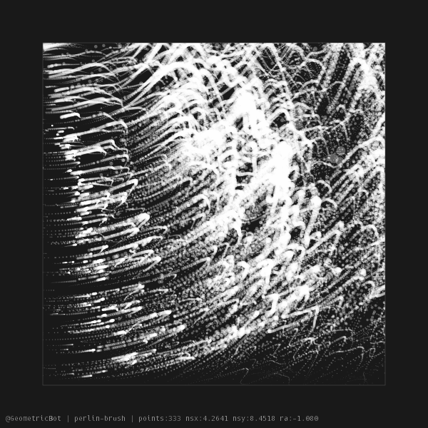

# geometric-bot
**Python3** experimental bot that generates randomly geometric-like images. **Always WIP**. This is my very first project with Python3 so be merciful with WIP parts or not-so-good-pactices ;)

Resulting images are posted in <https://twitter.com/@GeometricBot>

# modules used
`cairo, collections, colorsys, datetime, importlib, math, noise, os, random, random, sys`

Modules starting with `mod/algorithm` are the core of each type of geometric deisgn, rest of modules ( `draw, name, tweet` ) are utilities or general functionallities.

# config
The config settings and API keys are stored in the `config.yml` in the root of the project, a `config.yml.sample` is provided.
