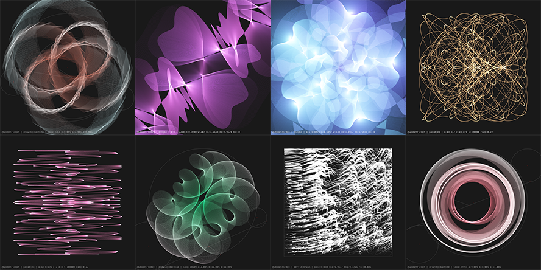

# geometric-bot
**Python3** experimental bot that generates randomly geometric-like images. **Always WIP**. This is my very first project with Python3 so be merciful with WIP parts, _spaguetti code_ or _not-so-good-practices_ this is a project to develop generative art ideas fast-and-dirty, not _state of the art_ code ;)

Resulting images are posted in <https://twitter.com/@GeometricBot>

# modules used

The modules you need to install in order to run GeometricBot by your own are in the `requirements.txt`.

Modules starting with `mod/algorithm` are the core of each type of geometric design, rest of modules ( `draw, name, tweet, colz` ) are utilities or general functionalities mostly coded by myself.

# config

The config settings and API keys are stored in the `config.yml` in the root of the project, a `config.yml.sample` is provided. At this moment this is only used for the tweeter API keys.

# license

 GeometricBot by <a xmlns:cc="http://creativecommons.org/ns#" href="https://github.com/carloscabo/geometric-bot" property="cc:attributionName" rel="cc:attributionURL">Carlos Cabo</a> is licensed under a <a rel="license" href="http://creativecommons.org/licenses/by-nc/4.0/">Creative Commons Attribution-NonCommercial 4.0 International License</a>. Based on a work at <a xmlns:dct="http://purl.org/dc/terms/" href="https://github.com/carloscabo/geometric-bot" rel="dct:source">https://github.com/carloscabo/geometric-bot</a>.
